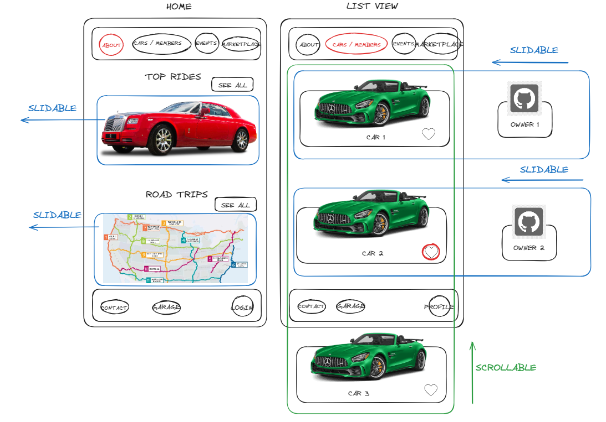
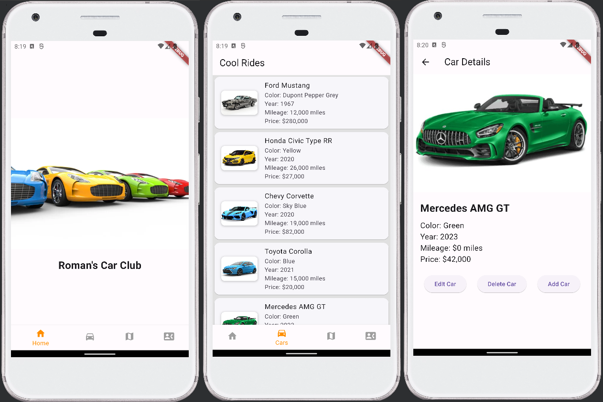
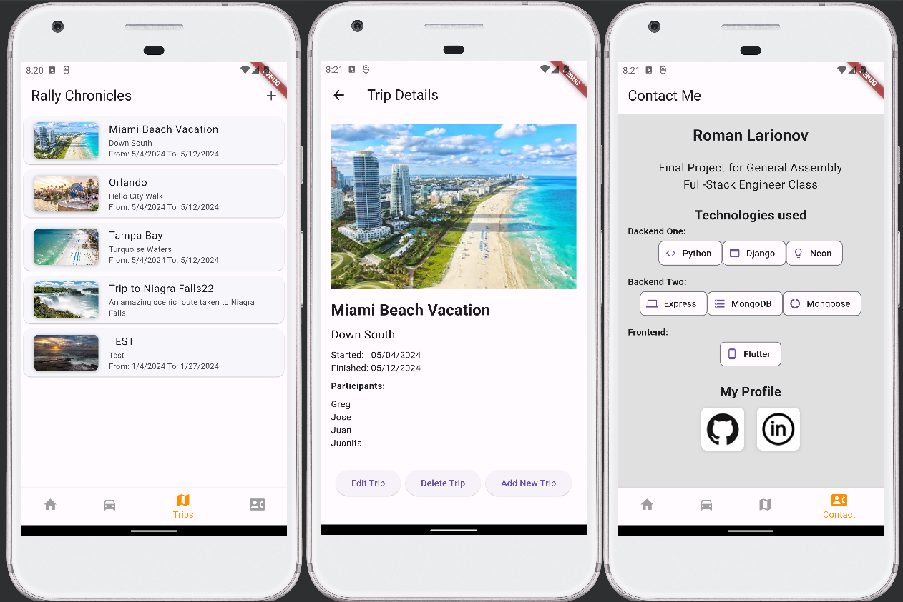

# A Car Club full CRUD app 
This app is an App created for a car club featuring members' cars and trips taken by the club members.

This app serves as a Final (Capstone) project for the General Assembly Full-Stack Engineer course.

The project utilizes 2 separate backends. One dedicated to cars and another one dedicated to trips.

# Technologies used:
1. Backend 1: MongoDB, Express (Cars)
2. Backend 2: Pythin, Django (Trips)
3. Fronend: Flutter framework

# Wireframe:

# Screenshots:

# Deployed links:

Cars backend: https://used-car-dealership-be.onrender.com/

Trips backend:https://car-club-model-2-be.onrender.com/

Frontend: https://rocknrome0409.web.app/

# GitHub repos:

Cars backend: https://github.com/rocknrome/Used-Car-Dealership-BE

Trips backend: https://github.com/rocknrome/Car-Club-RnR-Flutter-Model-2-BE

Frontend: https://github.com/rocknrome/Car-Club-RnR-Flutter